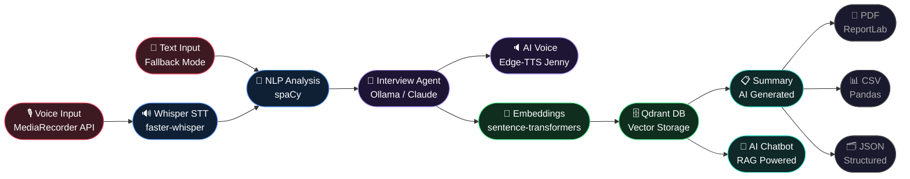

# Convera AI — System Flow Diagram

---

## Pipeline Summary

| Stage | Module | Technology |
|---|---|---|
| 🎙️ Voice Input | Browser recording | MediaRecorder API |
| 📝 Text Input | Fallback typing | Textarea |
| 🔊 Speech to Text | Audio → transcript | faster-whisper |
| 🧬 NLP Analysis | Skills, entities, topics | spaCy |
| 🤖 Interview Agent | Generates questions | Ollama / Claude |
| 🔈 AI Voice | Speaks questions aloud | Edge-TTS (Jenny Neural) |
| 🔢 Embeddings | Text → vectors | sentence-transformers |
| 🗄️ Vector Storage | Store & search knowledge | Qdrant |
| 📋 Summary | AI-generated profile | Ollama / Claude |
| 💬 AI Chatbot | Personalized assistant | RAG pipeline |
| 📄 Export PDF | Interview report | ReportLab |
| 📊 Export CSV | Spreadsheet data | Pandas |
| 🗂️ Export JSON | Structured knowledge | Python JSON |
